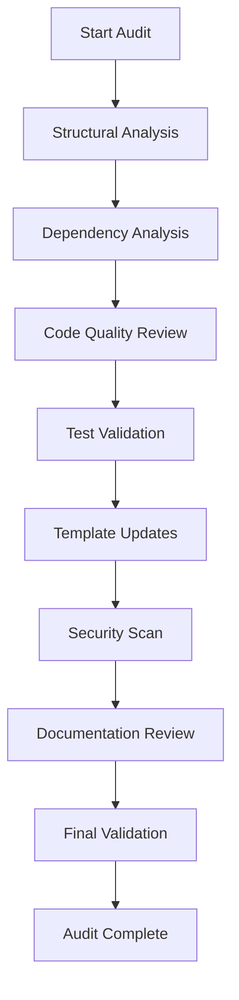

# Design Document

## Overview

This design outlines a systematic approach to auditing and cleaning up the open-source template generator codebase. The audit will be performed in phases, starting with structural analysis, followed by dependency updates, code cleanup, test validation, and finally documentation updates. The process will ensure the codebase follows Go best practices, removes technical debt, and maintains high quality standards.

## Architecture

### Audit Process Flow



### Phase-Based Approach

The audit will be conducted in the following phases:

1. **Structural Analysis Phase**: Analyze project structure and organization
2. **Dependency Management Phase**: Update and clean up dependencies
3. **Code Quality Phase**: Remove unused code and improve quality
4. **Testing Phase**: Ensure all tests pass and are properly organized
5. **Template Modernization Phase**: Update templates to latest versions
6. **Security Phase**: Scan for and fix security vulnerabilities
7. **Documentation Phase**: Update and validate documentation
8. **Validation Phase**: Final comprehensive validation

## Components and Interfaces

### 1. Project Structure Analyzer

**Purpose**: Analyze and validate the current project structure against Go conventions.

**Key Functions**:

- Validate package organization in `pkg/`, `internal/`, `cmd/` directories
- Check for proper separation of concerns
- Identify misplaced files or directories
- Validate naming conventions

**Analysis Areas**:

- `/cmd/` - Command-line applications
- `/internal/` - Private application code
- `/pkg/` - Public library code
- `/templates/` - Template files organization
- `/test/` - Test files placement

### 2. Dependency Manager

**Purpose**: Analyze, update, and clean up project dependencies.

**Key Functions**:

- Scan `go.mod` for unused dependencies
- Update dependencies to latest stable versions
- Check for security vulnerabilities
- Validate template dependencies (npm, gradle, etc.)

**Dependency Categories**:

- Go modules in `go.mod`
- Node.js packages in template `package.json` files
- Docker base images in Dockerfiles
- Kubernetes versions in manifests
- Mobile dependencies (Android/iOS)

### 3. Code Quality Analyzer

**Purpose**: Identify and remove unused, redundant, or low-quality code.

**Key Functions**:

- Detect unused functions, variables, and imports
- Identify duplicate code patterns
- Check code formatting and style
- Validate error handling patterns

**Tools Integration**:

- `go vet` for Go code analysis
- `golangci-lint` for comprehensive linting
- `gofmt` for formatting validation
- Custom scripts for template analysis

### 4. Test Validator

**Purpose**: Ensure all tests pass and follow best practices.

**Key Functions**:

- Run complete test suite
- Validate test file organization
- Check test coverage
- Ensure integration tests work correctly

**Test Categories**:

- Unit tests (`*_test.go`)
- Integration tests (`integration_test.go`)
- End-to-end tests
- Template generation tests

### 5. Template Modernizer

**Purpose**: Update all templates to use latest versions and best practices.

**Key Functions**:

- Update Go version to 1.22+
- Update Node.js to 20+, Next.js to 15+
- Update mobile frameworks (Kotlin 2.0+, Swift 5.9+)
- Update infrastructure tools (Docker 24+, K8s 1.28+)

**Template Categories**:

- Backend templates (`templates/backend/`)
- Frontend templates (`templates/frontend/`)
- Mobile templates (`templates/mobile/`)
- Infrastructure templates (`templates/infrastructure/`)
- Base templates (`templates/base/`)

### 6. Security Scanner

**Purpose**: Identify and fix security vulnerabilities.

**Key Functions**:

- Scan dependencies for known vulnerabilities
- Check for hardcoded secrets
- Validate security configurations
- Ensure secure defaults in templates

**Security Tools**:

- `go mod audit` for Go vulnerabilities
- `npm audit` for Node.js vulnerabilities
- Static analysis for secret detection
- Docker image vulnerability scanning

## Data Models

### Audit Report Structure

```go
type AuditReport struct {
    Timestamp    time.Time
    Phases       []PhaseResult
    Summary      AuditSummary
    Issues       []Issue
    Recommendations []Recommendation
}

type PhaseResult struct {
    Phase       string
    Status      string
    Duration    time.Duration
    Issues      []Issue
    Actions     []Action
}

type Issue struct {
    Type        string
    Severity    string
    File        string
    Line        int
    Description string
    Suggestion  string
}

type AuditSummary struct {
    TotalIssues     int
    CriticalIssues  int
    FilesAnalyzed   int
    TestsPassing    int
    TestsFailing    int
    CoveragePercent float64
}
```

### Dependency Update Model

```go
type DependencyUpdate struct {
    Type        string // "go", "npm", "docker", etc.
    File        string
    Package     string
    CurrentVersion string
    LatestVersion  string
    SecurityFix    bool
    BreakingChange bool
}
```

## Error Handling

### Error Categories

1. **Structural Errors**: Misplaced files, incorrect package structure
2. **Dependency Errors**: Outdated or vulnerable dependencies
3. **Code Quality Errors**: Unused code, formatting issues
4. **Test Errors**: Failing tests, missing test coverage
5. **Security Errors**: Vulnerabilities, exposed secrets
6. **Documentation Errors**: Outdated or incorrect documentation

### Error Recovery Strategy

- **Non-blocking errors**: Log and continue with audit
- **Critical errors**: Stop phase and report immediately
- **Fixable errors**: Attempt automatic fix with user confirmation
- **Manual errors**: Provide detailed instructions for manual fix

## Testing Strategy

### Audit Process Testing

1. **Unit Tests**: Test individual audit components
2. **Integration Tests**: Test complete audit workflow
3. **Regression Tests**: Ensure fixes don't break existing functionality
4. **Performance Tests**: Validate audit performance on large codebases

### Test Validation Strategy

1. **Pre-audit Test Run**: Establish baseline test results
2. **Post-cleanup Test Run**: Verify all tests still pass
3. **Template Generation Tests**: Ensure templates generate valid projects
4. **End-to-end Tests**: Validate complete project lifecycle

### Test Organization Validation

- Verify `*_test.go` naming convention
- Check test file co-location with source files
- Validate test package naming (`package main` vs `package main_test`)
- Ensure integration tests are properly tagged

## Implementation Phases

### Phase 1: Structural Analysis

- Analyze current project structure
- Identify organizational issues
- Create structure improvement plan
- Validate Go project conventions

### Phase 2: Dependency Management

- Audit `go.mod` for unused dependencies
- Update Go dependencies to latest stable versions
- Update template dependencies (npm, gradle, etc.)
- Check for security vulnerabilities

### Phase 3: Code Quality Improvement

- Run comprehensive linting
- Remove unused code (functions, variables, imports)
- Fix formatting and style issues
- Improve error handling patterns

### Phase 4: Test Validation and Cleanup

- Run complete test suite
- Fix failing tests
- Remove obsolete tests
- Improve test coverage where needed
- Validate test organization

### Phase 5: Template Modernization

- Update Go templates to 1.22+
- Update Node.js templates to 20+, Next.js to 15+
- Update mobile templates (Kotlin 2.0+, Swift 5.9+)
- Update infrastructure templates (Docker 24+, K8s 1.28+)
- Validate all template generation

### Phase 6: Security Audit

- Scan for security vulnerabilities
- Check for hardcoded secrets
- Validate security configurations
- Update security-related dependencies

### Phase 7: Documentation Update

- Update README files
- Fix code documentation
- Validate examples in documentation
- Update CLI help text

### Phase 8: Final Validation

- Run complete test suite
- Generate sample projects from templates
- Validate build process
- Create audit report

## Success Criteria

1. **Zero failing tests** in the test suite
2. **No unused dependencies** in go.mod
3. **No security vulnerabilities** in dependencies
4. **All templates use latest stable versions** of dependencies
5. **Proper project structure** following Go conventions
6. **Comprehensive documentation** that is accurate and up-to-date
7. **Clean codebase** with no unused or redundant code
8. **Successful project generation** from all templates
