# Design Document

## Overview

This design outlines a comprehensive testing framework for the open source template generator that validates all components work correctly. The testing suite will be organized into multiple layers: unit tests, integration tests, component-specific tests, end-to-end tests, and performance tests. The design leverages the existing testing infrastructure while adding comprehensive coverage for all supported components (frontend, backend, mobile, infrastructure).

## Architecture

### Testing Architecture Layers

```mermaid
graph TB
    A[Test Suite Entry Point] --> B[Unit Tests]
    A --> C[Integration Tests]
    A --> D[Component Tests]
    A --> E[E2E Tests]
    A --> F[Performance Tests]
    
    B --> B1[CLI Tests]
    B --> B2[Template Engine Tests]
    B --> B3[Config Manager Tests]
    B --> B4[File System Tests]
    
    C --> C1[Basic Integration]
    C --> C2[Template Processing]
    C --> C3[Configuration Management]
    
    D --> D1[Frontend Component Tests]
    D --> D2[Backend Component Tests]
    D --> D3[Mobile Component Tests]
    D --> D4[Infrastructure Component Tests]
    
    E --> E1[Full Stack Generation]
    E --> E2[Cross-Component Integration]
    E --> E3[CI/CD Workflow Validation]
    
    F --> F1[Generation Performance]
    F --> F2[Memory Usage]
    F --> F3[Concurrent Generation]
```



### Test Organization Structure

```
test/
├── comprehensive/                    # New comprehensive test suite
│   ├── main_test.go                 # Test suite entry point
│   ├── generator_test.go            # Core generator tests
│   ├── components/                  # Component-specific tests
│   │   ├── frontend_test.go         # Frontend component validation
│   │   ├── backend_test.go          # Backend component validation
│   │   ├── mobile_test.go           # Mobile component validation
│   │   └── infrastructure_test.go   # Infrastructure component validation
│   ├── e2e/                        # End-to-end tests
│   │   ├── fullstack_test.go       # Full stack project tests
│   │   ├── workflow_test.go        # CI/CD workflow tests
│   │   └── integration_test.go     # Cross-component integration
│   ├── performance/                # Performance tests
│   │   ├── generation_test.go      # Generation performance
│   │   ├── memory_test.go          # Memory usage tests
│   │   └── concurrent_test.go      # Concurrent generation tests
│   └── helpers/                    # Test utilities
│       ├── project_validator.go   # Project validation utilities
│       ├── build_tester.go        # Build testing utilities
│       └── docker_helper.go       # Docker testing utilities
```

## Components and Interfaces

### Core Testing Components

#### 1. Test Suite Manager

```go
type TestSuiteManager interface {
    RunAllTests(config *TestConfig) (*TestResults, error)
    RunComponentTests(components []string) (*TestResults, error)
    RunPerformanceTests() (*TestResults, error)
    GenerateTestReport(results *TestResults) error
}
```

#### 2. Project Validator

```go
type ProjectValidator interface {
    ValidateProjectStructure(projectPath string, config *models.ProjectConfig) error
    ValidateComponentBuild(componentType string, projectPath string) error
    ValidateDockerConfiguration(projectPath string) error
    ValidateKubernetesManifests(projectPath string) error
    ValidateTerraformConfiguration(projectPath string) error
}
```

#### 3. Build Tester

```go
type BuildTester interface {
    TestFrontendBuild(projectPath string, appType string) error
    TestBackendBuild(projectPath string) error
    TestMobileBuild(projectPath string, platform string) error
    TestDockerBuild(projectPath string, service string) error
}
```

#### 4. Component Test Runner

```go
type ComponentTestRunner interface {
    TestFrontendComponents(config *models.ProjectConfig, outputDir string) error
    TestBackendComponents(config *models.ProjectConfig, outputDir string) error
    TestMobileComponents(config *models.ProjectConfig, outputDir string) error
    TestInfrastructureComponents(config *models.ProjectConfig, outputDir string) error
}
```

### Testing Configuration

#### Test Configuration Model

```go
type TestConfig struct {
    TestTypes          []string          // unit, integration, component, e2e, performance
    ComponentsToTest   []string          // frontend, backend, mobile, infrastructure
    OutputDirectory    string            // Where to generate test projects
    CleanupAfterTest   bool             // Whether to cleanup generated projects
    ParallelExecution  bool             // Whether to run tests in parallel
    TimeoutDuration    time.Duration    // Test timeout
    BuildValidation    bool             // Whether to validate builds
    DockerValidation   bool             // Whether to test Docker builds
    PerformanceMetrics bool             // Whether to collect performance metrics
}
```

## Data Models

### Test Result Models

#### Test Results Structure

```go
type TestResults struct {
    Summary        TestSummary                    `json:"summary"`
    UnitTests      []TestResult                   `json:"unit_tests"`
    IntegrationTests []TestResult                 `json:"integration_tests"`
    ComponentTests map[string][]TestResult        `json:"component_tests"`
    E2ETests       []TestResult                   `json:"e2e_tests"`
    PerformanceTests []PerformanceTestResult      `json:"performance_tests"`
    GeneratedAt    time.Time                      `json:"generated_at"`
}

type TestSummary struct {
    TotalTests     int           `json:"total_tests"`
    PassedTests    int           `json:"passed_tests"`
    FailedTests    int           `json:"failed_tests"`
    SkippedTests   int           `json:"skipped_tests"`
    Duration       time.Duration `json:"duration"`
    Success        bool          `json:"success"`
}

type TestResult struct {
    Name        string        `json:"name"`
    Status      string        `json:"status"` // passed, failed, skipped
    Duration    time.Duration `json:"duration"`
    Error       string        `json:"error,omitempty"`
    Details     string        `json:"details,omitempty"`
    ProjectPath string        `json:"project_path,omitempty"`
}

type PerformanceTestResult struct {
    TestResult
    MemoryUsage    int64         `json:"memory_usage_bytes"`
    GenerationTime time.Duration `json:"generation_time"`
    FileCount      int           `json:"file_count"`
    DirectoryCount int           `json:"directory_count"`
}
```

### Component Validation Models

#### Component Test Configuration

```go
type ComponentTestConfig struct {
    ComponentType    string            `json:"component_type"`
    TestBuild        bool              `json:"test_build"`
    TestDependencies bool              `json:"test_dependencies"`
    TestSecurity     bool              `json:"test_security"`
    BuildTimeout     time.Duration     `json:"build_timeout"`
    CustomCommands   []string          `json:"custom_commands"`
    ExpectedFiles    []string          `json:"expected_files"`
    ExpectedDirs     []string          `json:"expected_dirs"`
}
```

## Error Handling

### Error Categories

#### Test Error Types

```go
type TestError struct {
    Type        string    `json:"type"`
    Component   string    `json:"component"`
    Message     string    `json:"message"`
    Details     string    `json:"details"`
    ProjectPath string    `json:"project_path,omitempty"`
    Timestamp   time.Time `json:"timestamp"`
}

const (
    ErrorTypeGeneration    = "generation"
    ErrorTypeValidation    = "validation"
    ErrorTypeBuild         = "build"
    ErrorTypeConfiguration = "configuration"
    ErrorTypePerformance   = "performance"
)
```

#### Error Handling Strategy

1. **Graceful Degradation**: Continue testing other components when one fails
2. **Detailed Logging**: Capture comprehensive error information for debugging
3. **Cleanup on Failure**: Ensure temporary resources are cleaned up
4. **Retry Logic**: Implement retry for transient failures (network, filesystem)
5. **Error Categorization**: Classify errors for better reporting and analysis

## Testing Strategy

### 1. Unit Tests Enhancement

- Extend existing unit tests in `pkg/cli/integration_test.go`
- Add comprehensive mocking for external dependencies
- Test edge cases and error conditions
- Validate configuration parsing and validation logic

### 2. Component-Specific Tests

#### Frontend Component Tests

```go
func TestFrontendComponents(t *testing.T) {
    testCases := []struct {
        name       string
        components models.FrontendComponents
        expected   []string // expected files/directories
    }{
        {
            name: "Next.js Main App",
            components: models.FrontendComponents{MainApp: true},
            expected: []string{"App/package.json", "App/next.config.js", "App/src/app/layout.tsx"},
        },
        {
            name: "Admin Dashboard",
            components: models.FrontendComponents{Admin: true},
            expected: []string{"Admin/package.json", "Admin/src/components/Dashboard.tsx"},
        },
        {
            name: "Landing Page",
            components: models.FrontendComponents{Home: true},
            expected: []string{"Home/package.json", "Home/src/app/page.tsx"},
        },
    }
    
    for _, tc := range testCases {
        t.Run(tc.name, func(t *testing.T) {
            // Generate project with specific frontend components
            // Validate structure and build
            // Test npm install and build commands
        })
    }
}
```

#### Backend Component Tests

```go
func TestBackendComponents(t *testing.T) {
    testCases := []struct {
        name       string
        components models.BackendComponents
        expected   []string
    }{
        {
            name: "Go API Server",
            components: models.BackendComponents{API: true},
            expected: []string{"CommonServer/go.mod", "CommonServer/main.go", "CommonServer/internal/"},
        },
    }
    
    for _, tc := range testCases {
        t.Run(tc.name, func(t *testing.T) {
            // Generate project with backend components
            // Validate Go module structure
            // Test go build and go test commands
            // Validate API endpoints and middleware
        })
    }
}
```

#### Mobile Component Tests

```go
func TestMobileComponents(t *testing.T) {
    testCases := []struct {
        name       string
        components models.MobileComponents
        platform   string
        expected   []string
    }{
        {
            name: "Android Kotlin App",
            components: models.MobileComponents{Android: true},
            platform: "android",
            expected: []string{"Mobile/Android/build.gradle", "Mobile/Android/app/src/main/"},
        },
        {
            name: "iOS Swift App",
            components: models.MobileComponents{IOS: true},
            platform: "ios",
            expected: []string{"Mobile/iOS/Package.swift", "Mobile/iOS/Sources/"},
        },
    }
    
    for _, tc := range testCases {
        t.Run(tc.name, func(t *testing.T) {
            // Generate project with mobile components
            // Validate platform-specific configurations
            // Test build configurations (gradle/swift)
        })
    }
}
```

#### Infrastructure Component Tests

```go
func TestInfrastructureComponents(t *testing.T) {
    testCases := []struct {
        name       string
        components models.InfrastructureComponents
        expected   []string
    }{
        {
            name: "Docker Configuration",
            components: models.InfrastructureComponents{Docker: true},
            expected: []string{"docker-compose.yml", "Dockerfile", ".dockerignore"},
        },
        {
            name: "Kubernetes Manifests",
            components: models.InfrastructureComponents{Kubernetes: true},
            expected: []string{"k8s/deployment.yaml", "k8s/service.yaml", "k8s/ingress.yaml"},
        },
        {
            name: "Terraform Configuration",
            components: models.InfrastructureComponents{Terraform: true},
            expected: []string{"Deploy/terraform/main.tf", "Deploy/terraform/variables.tf"},
        },
    }
    
    for _, tc := range testCases {
        t.Run(tc.name, func(t *testing.T) {
            // Generate project with infrastructure components
            // Validate configuration syntax
            // Test docker build, kubectl validate, terraform plan
        })
    }
}
```

### 3. End-to-End Tests

#### Full Stack Integration Tests

- Generate complete projects with all components
- Test cross-component communication (frontend to backend)
- Validate Docker Compose orchestration
- Test CI/CD workflow files

#### Build Validation Tests

- Test that generated projects build successfully
- Validate dependency resolution
- Test security configurations
- Validate documentation accuracy

### 4. Performance Tests

#### Generation Performance

- Measure project generation time for different configurations
- Test memory usage during generation
- Validate performance with large template sets
- Test concurrent project generation

#### Scalability Tests

- Test generation of multiple projects simultaneously
- Validate resource cleanup
- Test with various system resource constraints

## Implementation Plan

### Phase 1: Core Testing Infrastructure

1. Create test suite manager and configuration
2. Implement project validator utilities
3. Set up test result collection and reporting
4. Create helper utilities for build testing

### Phase 2: Component-Specific Tests

1. Implement frontend component tests
2. Implement backend component tests
3. Implement mobile component tests
4. Implement infrastructure component tests

### Phase 3: Integration and E2E Tests

1. Create full-stack integration tests
2. Implement cross-component validation
3. Add CI/CD workflow testing
4. Create Docker and containerization tests

### Phase 4: Performance and Reliability

1. Implement performance benchmarking
2. Add memory usage monitoring
3. Create concurrent generation tests
4. Add reliability and stress tests

### Phase 5: Reporting and CI Integration

1. Create comprehensive test reporting
2. Integrate with existing CI/CD pipeline
3. Add test result visualization
4. Create automated test scheduling

## Testing Tools and Dependencies

### Required Tools

- **Go Testing Framework**: Built-in `testing` package
- **Docker**: For container build testing
- **Node.js/npm**: For frontend build validation
- **kubectl**: For Kubernetes manifest validation
- **terraform**: For Terraform configuration validation
- **Android SDK**: For Android build testing (optional)
- **Xcode**: For iOS build testing (optional, macOS only)

### External Dependencies

- **testify**: For enhanced assertions and mocking
- **dockertest**: For Docker integration testing
- **gomega**: For advanced matchers and assertions
- **ginkgo**: For BDD-style testing (optional)

### CI/CD Integration

- Extend existing GitHub Actions workflows
- Add test result reporting and artifacts
- Create test matrix for different configurations
- Add performance regression detection
