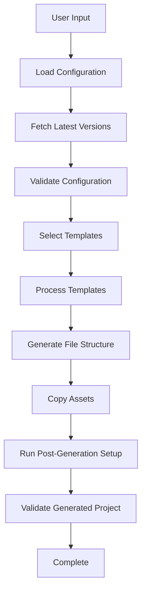
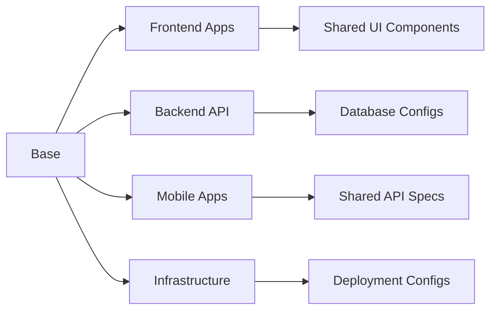

# Design Document

## Overview

The Open Source Template Generator is a command-line tool that creates production-ready, enterprise-grade project structures following modern best practices. The generator uses a template-driven approach with variable substitution to create customized projects with the latest package versions, comprehensive CI/CD, security configurations, and multi-platform support.

## Architecture

### Core Components

```
Template Generator
├── CLI Interface (Cobra-based)
├── Template Engine (Go text/template)
├── Configuration Manager
├── File System Generator
├── Package Version Manager
├── Validation Engine
└── Post-Generation Setup
```

### Template Structure

```
templates/
├── base/                    # Core project files
│   ├── root/               # Root-level files (Makefile, docker-compose.yml, etc.)
│   ├── docs/               # Documentation templates
│   └── github/             # GitHub-specific files
├── frontend/               # Frontend application templates
│   ├── nextjs-app/         # Main application template
│   ├── nextjs-home/        # Landing page template
│   └── nextjs-admin/       # Admin dashboard template
├── backend/                # Backend service templates
│   └── go-gin/             # Go + Gin API server template
├── mobile/                 # Mobile application templates
│   ├── android-kotlin/     # Android Kotlin template
│   └── ios-swift/          # iOS Swift template
├── infrastructure/         # Infrastructure templates
│   ├── terraform/          # Terraform configurations
│   ├── kubernetes/         # K8s manifests
│   └── docker/             # Docker configurations
└── config/                 # Configuration templates
    ├── versions.yaml       # Latest package versions
    └── defaults.yaml       # Default configurations
```

## Components and Interfaces

### 1. CLI Interface

**Purpose**: Provides user interaction for project configuration and generation.

**Interface**:

```go
type CLIInterface interface {
    Run() error
    PromptProjectDetails() (*ProjectConfig, error)
    SelectComponents() ([]string, error)
    ConfirmGeneration(*ProjectConfig) bool
}
```

**Implementation**:

- Uses Cobra CLI framework for command structure
- Interactive prompts using survey library
- Validation of user inputs
- Progress indicators during generation

### 2. Template Engine

**Purpose**: Processes template files with variable substitution and conditional logic.

**Interface**:

```go
type TemplateEngine interface {
    ProcessTemplate(templatePath string, config *ProjectConfig) ([]byte, error)
    ProcessDirectory(templateDir string, outputDir string, config *ProjectConfig) error
    RegisterFunctions(funcMap template.FuncMap)
}
```

**Implementation**:

- Go's text/template and html/template packages
- Custom template functions for string manipulation, version handling
- Conditional template rendering based on selected components
- Support for nested template includes

### 3. Configuration Manager

**Purpose**: Manages project configuration, component selection, and template variables.

**Interface**:

```go
type ConfigManager interface {
    LoadDefaults() (*ProjectConfig, error)
    ValidateConfig(*ProjectConfig) error
    GetLatestVersions() (*VersionConfig, error)
    MergeConfigs(base, override *ProjectConfig) *ProjectConfig
}

type ProjectConfig struct {
    Name         string
    Organization string
    Description  string
    License      string
    Components   []string
    Versions     *VersionConfig
    CustomVars   map[string]string
}

type VersionConfig struct {
    Node     string
    Go       string
    Kotlin   string
    Swift    string
    NextJS   string
    React    string
    Packages map[string]string
}
```

### 4. File System Generator

**Purpose**: Creates directory structures and files based on templates and configuration.

**Interface**:

```go
type FileSystemGenerator interface {
    CreateProject(config *ProjectConfig, outputPath string) error
    CreateDirectory(path string) error
    WriteFile(path string, content []byte, perm os.FileMode) error
    CopyAssets(srcDir, destDir string) error
}
```

**Implementation**:

- Recursive directory creation
- File permission handling
- Binary asset copying (images, fonts, etc.)
- Symlink creation for shared resources

### 5. Package Version Manager

**Purpose**: Fetches and manages latest package versions from various registries.

**Interface**:

```go
type VersionManager interface {
    GetLatestNodeVersion() (string, error)
    GetLatestGoVersion() (string, error)
    GetLatestNPMPackage(packageName string) (string, error)
    GetLatestGoModule(moduleName string) (string, error)
    UpdateVersionsConfig() (*VersionConfig, error)
}
```

**Implementation**:

- NPM registry API integration
- Go module proxy integration
- GitHub releases API for tools
- Caching mechanism for version data
- Semantic version parsing and validation

### 6. Validation Engine

**Purpose**: Validates generated project structure and configurations.

**Interface**:

```go
type ValidationEngine interface {
    ValidateProject(projectPath string) (*ValidationResult, error)
    ValidatePackageJSON(path string) error
    ValidateGoMod(path string) error
    ValidateDockerfile(path string) error
}

type ValidationResult struct {
    Valid  bool
    Errors []ValidationError
    Warnings []ValidationWarning
}
```

## Data Models

### Project Configuration

```go
type ProjectConfig struct {
    // Basic project information
    Name         string `yaml:"name" validate:"required,min=1,max=50"`
    Organization string `yaml:"organization" validate:"required"`
    Description  string `yaml:"description" validate:"required,max=200"`
    License      string `yaml:"license" validate:"required,oneof=MIT Apache-2.0 GPL-3.0 BSD-3-Clause"`
    
    // Component selection
    Components struct {
        Frontend struct {
            MainApp bool `yaml:"main_app"`
            Home    bool `yaml:"home"`
            Admin   bool `yaml:"admin"`
        } `yaml:"frontend"`
        Backend struct {
            API bool `yaml:"api"`
        } `yaml:"backend"`
        Mobile struct {
            Android bool `yaml:"android"`
            iOS     bool `yaml:"ios"`
        } `yaml:"mobile"`
        Infrastructure struct {
            Terraform  bool `yaml:"terraform"`
            Kubernetes bool `yaml:"kubernetes"`
            Docker     bool `yaml:"docker"`
        } `yaml:"infrastructure"`
    } `yaml:"components"`
    
    // Version configuration
    Versions *VersionConfig `yaml:"versions"`
    
    // Custom variables
    CustomVars map[string]string `yaml:"custom_vars"`
    
    // Output configuration
    OutputPath string `yaml:"output_path"`
}
```

### Template Metadata

```go
type TemplateMetadata struct {
    Name         string            `yaml:"name"`
    Description  string            `yaml:"description"`
    Version      string            `yaml:"version"`
    Dependencies []string          `yaml:"dependencies"`
    Variables    []TemplateVar     `yaml:"variables"`
    Conditions   []TemplateCondition `yaml:"conditions"`
}

type TemplateVar struct {
    Name        string `yaml:"name"`
    Type        string `yaml:"type"`
    Default     string `yaml:"default"`
    Description string `yaml:"description"`
    Required    bool   `yaml:"required"`
}

type TemplateCondition struct {
    Name      string `yaml:"name"`
    Component string `yaml:"component"`
    Value     bool   `yaml:"value"`
}
```

## Error Handling

### Error Types

```go
type GeneratorError struct {
    Type    ErrorType
    Message string
    Cause   error
    Context map[string]interface{}
}

type ErrorType int

const (
    ValidationError ErrorType = iota
    TemplateError
    FileSystemError
    NetworkError
    ConfigurationError
)
```

### Error Handling Strategy

1. **Validation Errors**: Collect all validation errors and present them to the user before generation
2. **Template Errors**: Provide detailed error messages with template file and line number
3. **File System Errors**: Handle permission issues, disk space, and path conflicts gracefully
4. **Network Errors**: Implement retry logic for version fetching with fallback to cached versions
5. **Recovery**: Implement cleanup mechanisms for partial generation failures

## Testing Strategy

### Unit Tests

1. **Template Engine Tests**
   - Template parsing and rendering
   - Variable substitution
   - Conditional logic
   - Custom template functions

2. **Configuration Manager Tests**
   - Configuration validation
   - Default value handling
   - Version management
   - Config merging

3. **File System Generator Tests**
   - Directory creation
   - File writing with proper permissions
   - Asset copying
   - Error handling

### Integration Tests

1. **End-to-End Generation Tests**
   - Complete project generation with different component combinations
   - Generated project validation
   - Build system functionality
   - Docker container creation

2. **Template Validation Tests**
   - All templates render without errors
   - Generated files have valid syntax
   - Package versions are compatible
   - Cross-references are correct

### Performance Tests

1. **Generation Speed Tests**
   - Large project generation performance
   - Memory usage during generation
   - Concurrent generation handling

2. **Version Fetching Tests**
   - API response time measurement
   - Caching effectiveness
   - Fallback mechanism performance

## Implementation Details

### Template Processing Flow



### Component Dependencies



### Version Management Strategy

1. **Version Sources**:
   - NPM Registry API for Node.js packages
   - Go Module Proxy for Go modules
   - GitHub Releases API for tools and frameworks
   - Maven Central for Android dependencies
   - CocoaPods Specs for iOS dependencies

2. **Caching Strategy**:
   - Local cache with TTL (24 hours)
   - Fallback to embedded default versions
   - Cache invalidation on user request

3. **Version Compatibility**:
   - Semantic version parsing
   - Compatibility matrix validation
   - Breaking change detection

### Security Considerations

1. **Template Security**:
   - Sanitize user inputs in templates
   - Validate template paths to prevent directory traversal
   - Limit template execution time

2. **File System Security**:
   - Validate output paths
   - Set appropriate file permissions
   - Prevent overwriting system files

3. **Network Security**:
   - HTTPS-only API calls
   - Certificate validation
   - Rate limiting for API requests

### Extensibility Design

1. **Plugin Architecture**:
   - Template plugin interface
   - Custom template function registration
   - Component plugin system

2. **Configuration Extension**:
   - Custom variable support
   - Template override mechanism
   - Component composition

3. **Template Inheritance**:
   - Base template extension
   - Partial template includes
   - Template composition patterns
