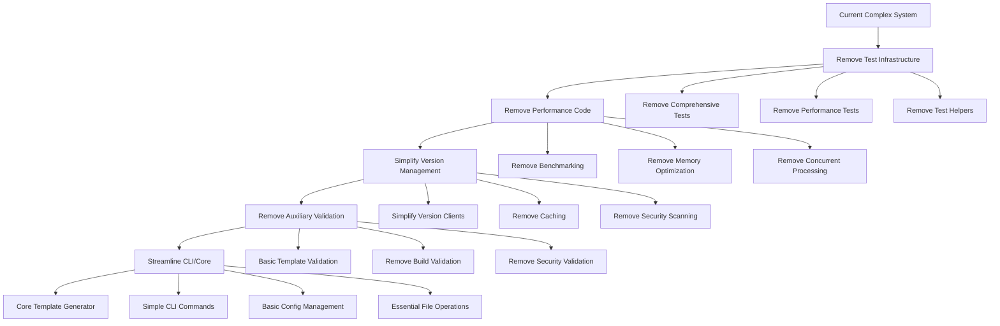

# Design Document

## Overview

This design outlines a systematic approach to remove excessive testing infrastructure, performance optimization code, and auxiliary features from the Open Source Template Generator while preserving its core template generation capabilities. The cleanup will focus on maintaining simplicity and reliability over optimization and comprehensive testing.

## Architecture

The cleanup will follow a layered approach, removing components from the outside in:



## Components and Interfaces

### Core Components to Retain

#### Template Engine (`pkg/template/`)

- **Keep**: `engine.go`, `processor.go`, `functions.go`, `metadata.go`
- **Remove**: `cache.go`, `parallel_processor.go`, `verification.go`, performance tests
- **Simplify**: Remove caching and optimization features from engine

#### CLI Interface (`pkg/cli/`)

- **Keep**: Basic `cli.go` with generate, help, version commands
- **Remove**: `template_analysis.go`, integration tests, advanced configuration
- **Simplify**: Remove analysis and validation features

#### Configuration Management (`internal/config/`)

- **Keep**: Basic `manager.go` for loading and parsing configs
- **Remove**: Advanced validation, caching, and optimization features
- **Simplify**: Keep essential config loading only

#### File System Operations (`pkg/filesystem/`)

- **Keep**: Basic `generator.go` and `project_generator.go`
- **Remove**: `optimized_io.go`, performance tests, integration tests
- **Simplify**: Remove optimization and advanced I/O features

### Components to Remove Entirely

#### Comprehensive Testing (`test/comprehensive/`)

- **Remove**: All files in this directory
- **Reason**: Excessive testing beyond core functionality needs

#### Performance Infrastructure

- **Remove**: `pkg/validation/performance.go`, `performance_benchmarking_test.go`
- **Remove**: `test/comprehensive/performance_test.go`, `concurrent_test.go`
- **Remove**: `test/comprehensive/helpers/performance_monitor.go`

#### Advanced Validation Systems

- **Remove**: `pkg/validation/security_validator.go`, `vercel_validator.go`
- **Remove**: `pkg/validation/project_types.go`, `setup.go`
- **Keep**: Basic `engine.go` and `template_validator.go` only

#### Complex Version Management

- **Remove**: `pkg/version/cache.go`, `storage.go`, `update_pipeline.go`
- **Remove**: Security integration tests and advanced registry features
- **Simplify**: Keep basic version fetching in clients and registries

### Interfaces to Simplify

#### Validation Interface (`pkg/interfaces/validation.go`)

```go
// Simplified interface
type Validator interface {
    ValidateTemplate(templatePath string) error
    ValidateProject(projectPath string) error
}
```

#### Template Interface (`pkg/interfaces/template.go`)

```go
// Simplified interface - remove caching and optimization methods
type Engine interface {
    ParseTemplate(templatePath string) (*Template, error)
    RenderTemplate(template *Template, data interface{}) ([]byte, error)
}
```

#### Version Interface (`pkg/interfaces/version.go`)

```go
// Simplified interface - remove caching and security features
type VersionManager interface {
    GetLatestVersion(packageName string) (string, error)
    GetVersionHistory(packageName string) ([]string, error)
}
```

## Data Models

### Simplified Models (`pkg/models/`)

#### Keep Essential Models

- `config.go` - Basic project configuration
- `template.go` - Template metadata and structure
- `errors.go` - Basic error types

#### Remove Complex Models

- `security.go` - Security validation models
- `validation.go` - Complex validation models
- `version.go` - Advanced version management models

#### Simplified Config Model

```go
type ProjectConfig struct {
    Name         string     `yaml:"name"`
    Organization string     `yaml:"organization"`
    Components   Components `yaml:"components"`
    OutputPath   string     `yaml:"output_path"`
}

type Components struct {
    Frontend       FrontendComponents       `yaml:"frontend"`
    Backend        BackendComponents        `yaml:"backend"`
    Mobile         MobileComponents         `yaml:"mobile"`
    Infrastructure InfrastructureComponents `yaml:"infrastructure"`
}
```

## Error Handling

### Simplified Error Strategy

#### Keep Basic Error Types

- Template parsing errors
- File system operation errors
- Configuration validation errors

#### Remove Complex Error Handling

- Performance monitoring errors
- Security validation errors
- Advanced validation error types
- Detailed error reporting and metrics

#### Error Handling Pattern

```go
// Simple error wrapping
func (e *Engine) ProcessTemplate(path string) error {
    if err := e.validateTemplate(path); err != nil {
        return fmt.Errorf("template validation failed: %w", err)
    }
    
    if err := e.renderTemplate(path); err != nil {
        return fmt.Errorf("template rendering failed: %w", err)
    }
    
    return nil
}
```

## Testing Strategy

### Minimal Testing Approach

#### Unit Tests to Keep

- Core template engine tests (`pkg/template/engine_test.go`)
- Basic CLI functionality tests (`pkg/cli/cli_test.go`)
- Configuration parsing tests (`internal/config/manager_test.go`)
- Essential file operations tests (`pkg/filesystem/generator_test.go`)

#### Tests to Remove

- All comprehensive integration tests
- Performance and benchmarking tests
- Concurrent generation tests
- Complex validation tests
- Security validation tests
- Build validation tests

#### Testing Structure

```
pkg/
├── cli/cli_test.go                    # Basic CLI tests
├── template/engine_test.go            # Core template tests
├── filesystem/generator_test.go       # Basic file operations
└── models/config_test.go              # Configuration tests

internal/
└── config/manager_test.go             # Config management tests
```

## Implementation Phases

### Phase 1: Remove Test Infrastructure

1. Delete `test/comprehensive/` directory entirely
2. Remove performance and benchmarking test files
3. Clean up test helper utilities
4. Keep only essential unit tests

### Phase 2: Remove Performance Code

1. Remove caching mechanisms from template engine
2. Delete performance monitoring and optimization code
3. Remove concurrent processing features
4. Simplify interfaces to remove optimization methods

### Phase 3: Simplify Version Management

1. Remove version caching and storage systems
2. Delete security scanning and vulnerability checking
3. Keep basic version fetching from npm, Go, and GitHub
4. Remove complex registry management features

### Phase 4: Remove Auxiliary Validation

1. Delete security validators and project type validators
2. Remove build validation and setup validation
3. Keep basic template syntax validation only
4. Simplify validation interfaces and models

### Phase 5: Streamline Core Components

1. Simplify CLI to basic commands only
2. Remove advanced configuration features
3. Clean up file system operations
4. Remove resource management and optimization

### Phase 6: Update Documentation

1. Update README to reflect simplified functionality
2. Remove references to removed features
3. Update build and development instructions
4. Simplify contribution guidelines

## Migration Strategy

### Backward Compatibility

- Maintain existing CLI command structure for basic operations
- Keep essential configuration file format
- Preserve core template generation functionality

### Configuration Migration

- Remove unused configuration options
- Keep essential project configuration fields
- Maintain template selection and output path options

### API Stability

- Maintain core public interfaces for template generation
- Remove performance and optimization related APIs
- Keep essential error types and handling
