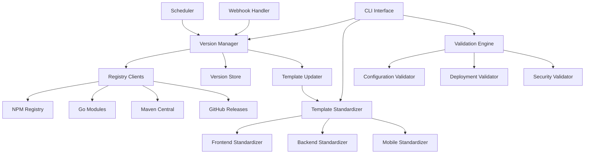

# Design Document

## Overview

The Template Version Management system will provide automated version updates, template standardization, and consistency validation across all project templates. The system consists of three main components: a Version Manager for tracking and updating versions, a Template Standardizer for ensuring consistency, and a Validation Engine for verifying template integrity.

## Architecture



## Components and Interfaces

### Version Manager

**Purpose:** Central component for managing version information and updates across all templates.

**Key Interfaces:**
- `VersionRegistry`: Interface for querying external registries
- `VersionStore`: Interface for persisting version information
- `TemplateUpdater`: Interface for applying version updates to templates

**Implementation:**
```go
type VersionManager struct {
    registries map[string]VersionRegistry
    store      VersionStore
    updater    TemplateUpdater
}

type VersionInfo struct {
    Language    string
    CurrentVersion string
    LatestVersion  string
    SecurityIssues []SecurityIssue
    UpdatedAt      time.Time
}
```

### Template Standardizer

**Purpose:** Ensures consistent configurations across all templates, especially frontend templates for Vercel deployment.

**Frontend Standardization Rules:**
1. **Package.json Scripts:** All Next.js templates must have identical script configurations
2. **TypeScript Configuration:** Standardized tsconfig.json across all TypeScript templates
3. **ESLint Configuration:** Consistent linting rules and plugins
4. **Vercel Configuration:** Standardized vercel.json for deployment
5. **Build Configuration:** Consistent build settings and output directories
6. **Development Ports:** Standardized port assignments (app: 3000, home: 3001, admin: 3002)

**Key Standardization Areas:**
```yaml
frontend_standards:
  nextjs:
    node_version: ">=22.0.0"
    npm_version: ">=10.0.0"
    scripts:
      dev: "next dev"
      build: "next build"
      start: "next start"
      lint: "next lint"
      type-check: "tsc --noEmit"
    dependencies:
      core: ["next", "react", "react-dom", "typescript"]
      ui: ["tailwindcss", "clsx", "class-variance-authority"]
      testing: ["jest", "@testing-library/react"]
    vercel_config:
      framework: "nextjs"
      build_command: "npm run build"
      output_directory: ".next"
```

### Registry Clients

**Purpose:** Interface with external package registries to fetch latest version information.

**Supported Registries:**
- **NPM Registry:** For Node.js, Next.js, React packages
- **Go Modules:** For Go language versions and dependencies
- **Maven Central:** For Java dependencies
- **GitHub Releases:** For language runtime versions
- **Docker Hub:** For base image versions

**Implementation Strategy:**
```go
type NPMClient struct {
    baseURL string
    client  *http.Client
}

func (c *NPMClient) GetLatestVersion(packageName string) (*VersionInfo, error) {
    // Query NPM registry API
    // Parse response and extract version info
    // Check for security vulnerabilities
}
```

### Validation Engine

**Purpose:** Validates template consistency, deployment readiness, and security compliance.

**Validation Categories:**

1. **Configuration Validation:**
   - Verifies all frontend templates have matching base configurations
   - Checks for required files (package.json, tsconfig.json, etc.)
   - Validates script consistency across templates

2. **Deployment Validation:**
   - Ensures Vercel compatibility for all frontend templates
   - Validates Docker configurations for backend templates
   - Checks environment variable consistency

3. **Security Validation:**
   - Scans for known vulnerabilities in specified versions
   - Validates security-related configurations
   - Checks for outdated dependencies with security issues

## Data Models

### Version Configuration

```yaml
# versions.yaml (enhanced version of versions.md)
languages:
  java:
    current: "22.3.0"
    lts: "21.0.0"
    security_advisories: []
  nodejs:
    current: "22.19.0"
    lts: "20.18.0"
    security_advisories: []
  go:
    current: "1.25.1"
    previous: "1.24.0"
    security_advisories: []

frameworks:
  nextjs:
    current: "15.5.2"
    compatible_react: ["19.1.0"]
    security_advisories: []
  react:
    current: "19.1.0"
    previous: "18.3.0"
    security_advisories: []

update_policy:
  auto_update: true
  security_priority: true
  breaking_change_approval: true
  update_schedule: "daily"
```

### Template Metadata

```yaml
# template-metadata.yaml
templates:
  frontend:
    nextjs-app:
      type: "application"
      deployment_target: "vercel"
      required_versions: ["nodejs", "nextjs", "react"]
      port: 3000
    nextjs-home:
      type: "landing"
      deployment_target: "vercel"
      required_versions: ["nodejs", "nextjs", "react"]
      port: 3001
    nextjs-admin:
      type: "dashboard"
      deployment_target: "vercel"
      required_versions: ["nodejs", "nextjs", "react"]
      port: 3002
```

## Error Handling

### Version Update Failures
- **Registry Unavailable:** Use cached versions with warning
- **Invalid Version Format:** Log error and maintain current version
- **Breaking Changes Detected:** Flag for manual review
- **Security Vulnerabilities:** Force update to secure version

### Template Update Failures
- **File Lock Conflicts:** Retry with exponential backoff
- **Template Syntax Errors:** Rollback to previous version
- **Validation Failures:** Block update until issues resolved

### Validation Failures
- **Configuration Inconsistencies:** Generate detailed diff report
- **Deployment Issues:** Provide specific remediation steps
- **Security Issues:** Block template generation until resolved

## Testing Strategy

### Unit Testing
- **Version Manager:** Test version comparison, update logic, registry interactions
- **Template Standardizer:** Test configuration merging, file generation, consistency checks
- **Validation Engine:** Test validation rules, error detection, reporting

### Integration Testing
- **End-to-End Version Updates:** Test complete update cycle from registry to template
- **Template Generation:** Verify generated projects work locally and deploy to Vercel
- **Cross-Template Consistency:** Validate all frontend templates produce consistent results

### Performance Testing
- **Registry Query Performance:** Measure response times for version checks
- **Template Update Speed:** Benchmark bulk template updates
- **Validation Performance:** Test validation speed on large template sets

### Security Testing
- **Vulnerability Detection:** Test security advisory integration
- **Version Validation:** Verify security version enforcement
- **Template Security:** Validate generated templates follow security best practices

## Implementation Phases

### Phase 1: Version Management Core
1. Implement basic version manager with registry clients
2. Create version storage and update mechanisms
3. Add CLI commands for manual version updates
4. Implement basic validation for version consistency

### Phase 2: Template Standardization
1. Analyze current frontend template differences
2. Create standardized configuration templates
3. Implement template updater with standardization rules
4. Add validation for template consistency

### Phase 3: Automation and Monitoring
1. Add scheduled version checking
2. Implement automated template updates
3. Create reporting and notification system
4. Add webhook support for external triggers

### Phase 4: Advanced Features
1. Add breaking change detection and approval workflow
2. Implement rollback capabilities
3. Add advanced security scanning
4. Create dashboard for version management overview